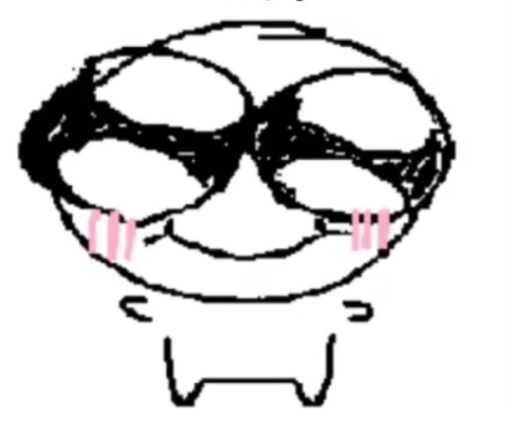
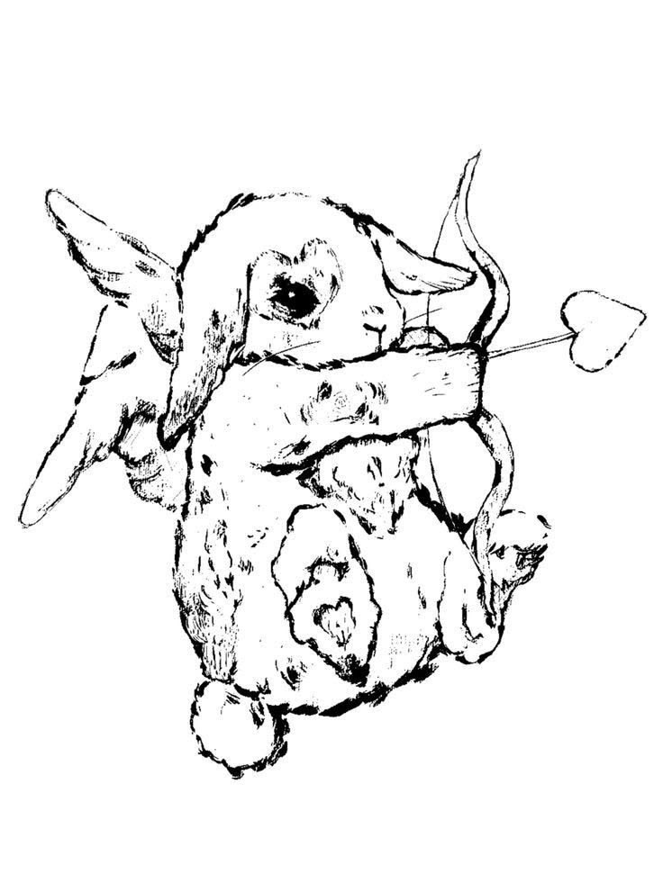
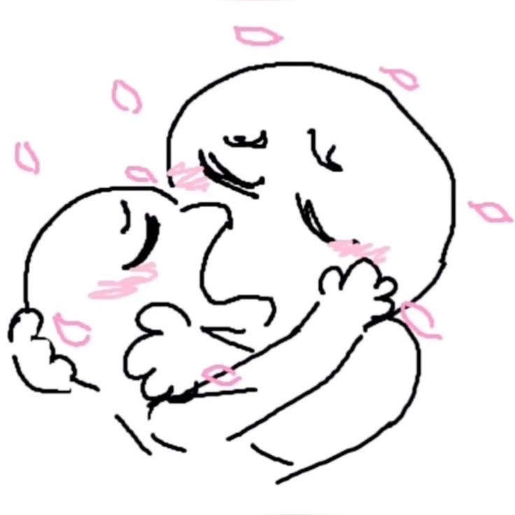
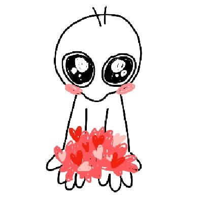
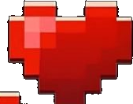
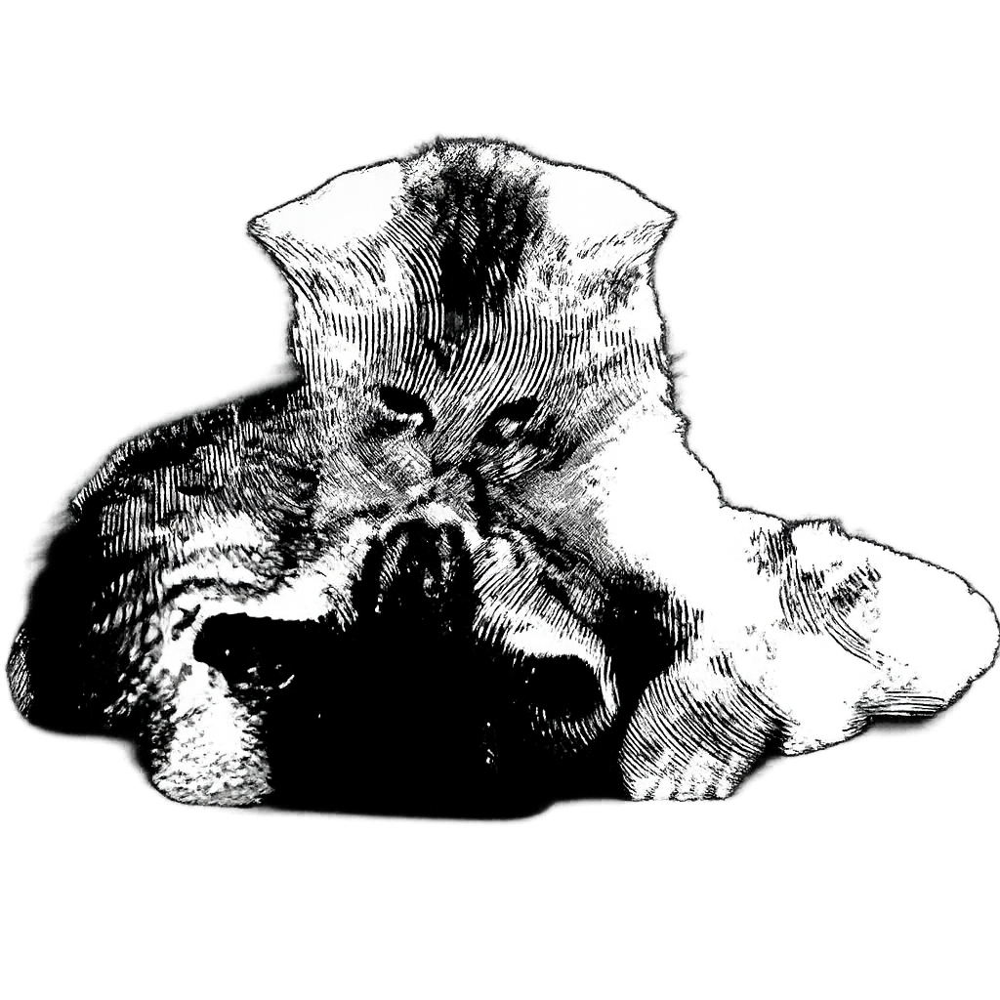
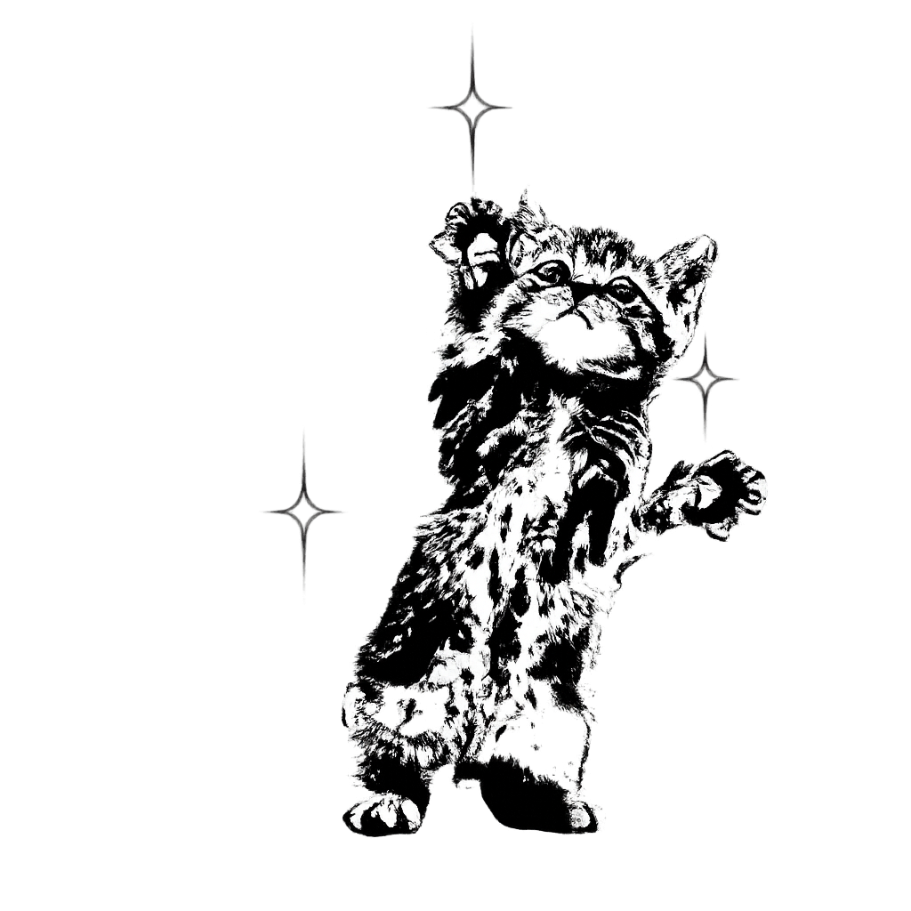

<html lang="es">
<head>
<meta charset="UTF-8">
<meta name="viewport" content="width=device-width, initial-scale=1.0">
<title>Para ti</title>
<link rel="preconnect" href="https://fonts.googleapis.com">
<link href="https://fonts.googleapis.com/css2?family=Dancing+Script:wght@500;700&family=Cormorant+Garamond:ital,wght@0,400;0,600;1,400&display=swap" rel="stylesheet">

</head>
<body>

  

  
Tengo algo para ti, ¿quieres verlo?

  <button class="intro-btn" id="introBtn">SIIII</button>

  

    
  

  

    
  

  

    
  

  

    
  

  

    
  

  

    
  

  

    
  

  

    
  

  

    
  

  

    
  

<audio id="bgMusic" src="assets/musica.mp3" loop preload="auto"></audio>

  

  

  

    

    

    

    

    

  

  
toca el sobre

  

    para ti
    
Me gustas, te pienso, te sueño… ¿dejamos de esconder nuestro amor?

    
— con todo mi corazón

    

      <button class="choice btn-yes" id="btnYes">sí</button>
      <button class="choice btn-kiss" id="btnKiss">te doy un beso</button>
    

    

    

      para ti, otra vez
      
No existe humo capaz de llenar mis pulmones como lo hace el aire que queda después de un beso tuyo.

      
Podría perderme entre nubes, dejar que el mundo se vuelva gris, pero ni el humo más profundo lograría reemplazar la forma en que respira mi corazón cuando te encuentra.

      
Me siento vivo cada vez que tus brazos me recuerdan que hay un lugar donde pertenezco. Cada abrazo tuyo es una primavera escondida debajo de mi pecho.

      
Tus labios tienen esa extraña costumbre de devolverle color a mis días, como si supieran despertar todo lo que creía dormido.

      
— con todo mi corazón

    

    

      un poquito más
      
Cada vez que me besas, mi corazón despierta como un árbol después del invierno, y vuelve a latir con una fuerza que había olvidado.

      
Pero devuélvete, porque hay otra cosita que quiero que leas…

      <button class="btn-back" id="btnBack">volver</button>
    

  

  

  

</body>
</html>
